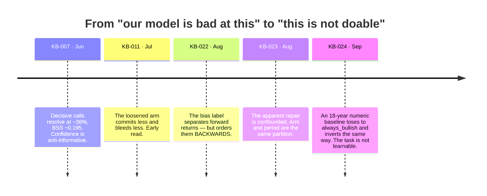

# The cut (v1.6)

On 2026-09-05 this project deleted its main feature.

If you are reading anything in this repository dated before that, you are reading
about a system that made directional predictions. It does not any more. This page
is the bridge.

---

## What was cut

The daily note's 5-Day Outlook table used to lead with two columns:

| Asset | ~~Bias~~ | ~~Confidence %~~ | Primary Driver | Target Range |
|---|---|---|---|---|
| S&P 500 | ~~Bullish~~ | ~~68%~~ | ... | ... |

Both are gone. Not hidden, not defaulted — **removed from the schema**, so MA-1
is no longer asked for a directional call at all.

Removed with them:

- `_apply_accuracy_override_structured()` and its free-text twin — the four
  post-hoc checks (bias floor below 40% accuracy, wasted-signal warning at ≥70%,
  confidence clustering, all-Neutral `FAIL`) that constituted the self-calibration
  feedback loop. Every one of them read or wrote `bias` / `confidence_pct`.
- The `confidence_delta` half of the MA-2 adversarial pass.
- Every prompt block gated by the run-profile toggles. `MACRO_PROFILE`,
  `CONVICTION_FLOOR`, `BASE_RATE_FIRST` and `PRUNE_RULES` still resolve and are
  still recorded in frontmatter — the historical readers need that — but the
  blocks they gated were directional-call rules and are **inert**.

## The evidence, in order

This was not a hunch. It was five findings over four months, each of which
narrowed the possible explanations.

**[KB-007]** established that the confidence number was anti-informative, and
monotonically so — higher stated confidence resolved worse. That is a
calibration failure and calibration failures are fixable, so the project tried
to fix it.

**[KB-022]** was the first sign of something worse. The bias label *did* separate
forward returns; it just ordered them backwards. Bearish calls preceded higher
returns than bullish ones. An inverted signal is still information, so this read
as a sign-flip problem.

**[KB-023]** killed the apparent repair. The loosened-profile A/B had switched
`MACRO_PROFILE` in one block, so the two arms shared **zero** report dates — arm
and market period were the same partition of the data. The measurement could not
distinguish "the loosened prompt fixed it" from "the market changed". Not a
failed result; an unreadable one.

At that point every measurement in the repo had one thing in common: **they all
measured the LLM.** None of them could distinguish *this model is bad at the
task* from *this task is not doable from this payload*.

**[KB-024]** asked the second question directly, with the LLM removed. An 18-year
panel (5,655 business days), 20 features, walk-forward with a `horizon + 1`
embargo, only never-revised inputs, a planted-signal positive control, and a bar
committed before the run. Two small regularised model classes against three
comparators, all scored on the same 75,432 calls by the *production* readers:

| Arm | n decisive | hit-rate | Brier | BSS | ECE | separation |
|---|---|---|---|---|---|---|
| `ridge` | 42,043 | 0.530 | 0.271 | −0.087 | 0.119 | inverted |
| `gbm` | 40,173 | 0.526 | 0.264 | −0.059 | 0.103 | inverted |
| `random_walk` | 58,733 | 0.498 | 0.253 | −0.011 | 0.052 | inverted |
| **`always_bullish`** | 61,073 | **0.557** | **0.247** | **−0.000** | **0.007** | n/a |

A constant that carries no information beat both fitted models on hit-rate,
Brier, BSS **and** calibration error simultaneously. `ridge`'s 90–100% confidence
bin resolved at 0.404.

And the mechanism was legible, which is what made it conclusive rather than
merely discouraging: `drawdown` was the only input both model classes found
load-bearing, signed **stress → bearish**, and stress mean-reverts at 10–20 days.
The one stable relationship in the panel is contrarian. The LLM had been finding
the same relationship and being punished by it in exactly the same way.

## Why deletion rather than a fix

The decision reasoning, recorded so it is not re-litigated
([ADR-0009](../decisions/ADR-0009-cut-the-directional-product.md)):

> Correcting the direction of a call that carries no information is not a smaller
> error, it is a more elaborate one.

The feedback loop had been steering next week's calls using last week's accuracy.
If the calls carry no signal, that machinery is an apparatus for producing
confident noise. So it went too.

The alternative on the table — WP-21.B.2, a day-alternating A/B to rank two
prompt configurations properly — was cancelled for the same reason. It could only
ever have established which of two prompts was better at a task that had just
been shown to have no learnable answer, and waiting for it meant months of
publishing ~36%-accurate calls at ~63% stated confidence.

## What replaced it

Nothing new had to be built. The replacement was already in the note, buried in
the driver prose.

**The empirical conditional return distribution.** For each asset, the median
and P25/P75 of realized forward returns in the current macro-state bucket
(NFCI tier × yield-curve sign × HY tier), with the sample count `n`. It is
rendered by Python from `conditional_distributions.json` after the analysis, so
the model cannot alter it, and where an asset has no bucket the column says so
rather than improvising.

**The Fragility Monitor, promoted to the headline.** This is the one product in
the repo with validated out-of-sample skill ([KB-017], [KB-021]), and it ships
with its limit attached: precision ≈ 0.32, high recall, a warning and never a
forecast.

The shape of the swap is the point. The system stopped publishing *what it
thinks will happen* and started publishing *what has historically happened in
conditions like these, and whether the tape currently looks fragile*. Both are
measured. Neither is a forecast.

## What the cut did to everything downstream

| Thing | What happened |
|---|---|
| `score_predictions.py` | Scores the thing that was cut. Gates on version, returns `None` for v1.6+. Frozen, winding down — last window resolves ~2026-10-02 |
| The accuracy record | **Finite.** The last directional note is 2026-09-04. The weekly stage prints a `DIRECTIONAL RECORD CLOSED` banner when every window has resolved |
| `summarize_accuracy.py`, `bias_separation.py` | Still work, still run. They read the history, and that history is the evidence base for KB-007 / 011 / 022 |
| Kimi ensemble arm | Deactivated. Its whole purpose was calibrating a `confidence_pct` that no longer exists |
| Exogenous branch | Its gate was a head-to-head A/B against the market-only arm. That comparator froze, so the gate became *unreadable* rather than failed — which is what forced WP-19.E |
| Phase 20 paper portfolio | Sized from bias + confidence. `rebalance.run()` now detects a post-cut note and declines to advance the book, with a message saying why |
| Phase 22 | Exists because of the cut: since 2026-09-05 the pipeline had been publishing a product **no scorer measured** |

That last row is the tidy summary of the whole episode. Cutting the product left
the measurement apparatus pointed at a thing that no longer existed, and it took
three days to notice.

## What happened after

The cut did not close the question — it opened a bounded search, capped at three
feature families, each pre-registered and sealed before it runs.

- **[KB-026]** — the SPF exogenous anchor. Negative. Worse than the market panel
  it was added to.
- **[KB-027]** — family 1, the VIX term structure. Negative, on three independent
  readings, with the same contrarian mechanism as [KB-024]. It also exposed the
  defect in the pre-committed bar (see [The method](the-method.md), §10).
- **Families 2 and 3** — deliberately blocked, pending a written decision on the
  BSS floor. Deciding it now, with no candidate family on the table, is the only
  moment it can be decided honestly.

The honest prior after three independent negatives is low, and the roadmap says
so.

---

**Next:** [What we believe](what-we-believe.md) — the standing conclusions,
including the things that *did* work.
