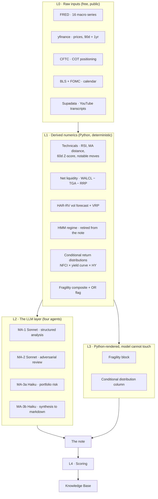

# The signal stack

How a number goes from a public data source to a published claim — and, just as
importantly, which layer is allowed to change it on the way.

## L0 — raw inputs

Everything is free and most of it needs no key. The full catalogue is in
[Reference → Data sources](../reference/data-sources.md). Two properties of L0
matter conceptually and get forgotten constantly:

**Not all FRED series are equal.** Some are *revised* after publication (CPI,
payrolls, M2, WALCL, NFCI, claims); some are *market-observed and never revised*
(`DGS10`, `DGS2`, `BAA10Y`, `T10YIE`, `DFII10`, `VIXCLS`). For the daily note the
distinction is cosmetic. For any backtest it is the whole ballgame — today's
vintage of a revised series is not what was knowable at the time, and using it
manufactures skill out of nothing. This is why the numeric baseline accepts
*only* never-revised inputs
([ADR-0014](../decisions/ADR-0014-point-in-time-without-alfred.md)).

**Staleness is data.** Every FRED series carries a `days_stale` field and the
model is instructed on tiered staleness rules, because GDP is routinely 60–90
days old and pretending otherwise would put a stale number in a sentence about
today.

## L1 — derived numerics

Everything here is deterministic Python. No model sees these computations; it
only sees their output. Four families:

- **Technicals and liquidity** — RSI, distance from the 50d MA, a 60-day Z-score
  of today's return, a notable-moves detector, and the Net Liquidity construction
  (`WALCL/1000 − WTREGEN − RRPONTSYD`) with its rolling trend.
- **Volatility** — HAR-RV forecasts for four assets plus the VIX variance risk
  premium for the S&P.
- **State** — a 4-state Gaussian HMM over NFCI percentile, yield-curve slope, HY
  z-score and realized-vol percentile, and the conditional return distributions
  bucketed by a 3-dimensional macro snapshot. The HMM **is still computed but no
  longer enters the note**: a four-feature rule beat it out of sample and it was
  redundant with fragility ([KB-006],
  [ADR-0004](../decisions/ADR-0004-retire-hmm-from-the-note.md)).
- **Fragility** — a 0–100 composite over variance trend, VIX term structure,
  level acceleration and cross-asset correlation, plus the OR-of-channels flag
  (composite | absorption | turbulence, each against its own point-in-time top
  decile).

L1 is where most of the project's validated skill lives. It is also the only
layer that has ever survived a hostile out-of-sample test — see
[What we believe](what-we-believe.md).

## L2 — the LLM layer

Four narrow calls rather than one wide one. The reasoning is that a single agent
asked to analyse, self-critique, assess a portfolio and format markdown will do
all four badly and will rubber-stamp its own predictions.

| Agent | Model | Sees | Produces |
|---|---|---|---|
| MA-1 | Sonnet | the full payload | a validated `AnalysisOutput` via `tool_use` |
| MA-2 | Sonnet | **only** the outlook rows + key risks | a JSON delta of added risks |
| MA-3a | Haiku | **only** regime label + positions | a structured portfolio risk read |
| MA-3b | Haiku | the structured JSON | the final markdown body |

Two design rules do the heavy lifting here, and both are about **removing the
model's ability to be creative in the wrong place**:

1. **The schema carries the structure, not the output stream.** MA-1 returns a
   Pydantic object through tool use, so section order and constraints are never
   something the model has to remember, and never something it can quietly
   violate ([ADR-0002](../decisions/ADR-0002-structured-output-contract.md)).
2. **The adversarial pass is deliberately starved of context.** MA-2 gets the
   predictions and the risks and nothing else, because an agent shown the
   reasoning that produced a claim will agree with it.

## L3 — the blocks Python renders after the model is done

This is the layer that v1.6 created, and it is the structural expression of
everything the project has learned.

The Fragility Monitor block and the conditional distribution column are
**computed in Python and written into the note after the LLM calls have
returned**. The model does not author them, cannot revise them, and — in the
fragility case at `log` mode — does not even see them.

The reason is not distrust of the model in the abstract. It is that these two
blocks are *measured data*, and a language model asked to render measured data
will occasionally tidy a percentile. MA-3b's job is explicitly to copy the
pre-formatted outlook table verbatim, which mattered less when the columns were
opinions and matters a great deal now that they are the product.

## L4 — scoring, and the layer above it

The scoring layer grades what L3 published. It has two generations:

- `score_predictions.py` — the directional scorer. **Frozen and winding down.**
  It gates on pipeline version, so v1.5-and-earlier history stays reproducible
  and the findings built on it stay reproducible with it
  ([ADR-0010](../decisions/ADR-0010-freeze-the-directional-scorer.md)). Its last
  open window resolves ~2026-10-02.
- `score_distributions.py` — the distribution scorer. Pinball loss at
  q25/50/75, interval coverage, a PIT histogram, against three trivial rivals.
  Live since Phase 22.

And above all of it sits the thing that makes this project unusual:

**`numeric_baseline.py` does not measure the model. It measures the task.** It
fits deliberately small regularised numeric models walk-forward on the same
inputs and asks whether *anything* can predict direction here. Every other
metric in the repo answers "is our analyst good?"; this one answers "is this
question answerable?" — and the answer was no, which is why the product it
graded no longer exists.

---

**Next:** [The method](the-method.md) — the rules that make those answers
trustworthy.
