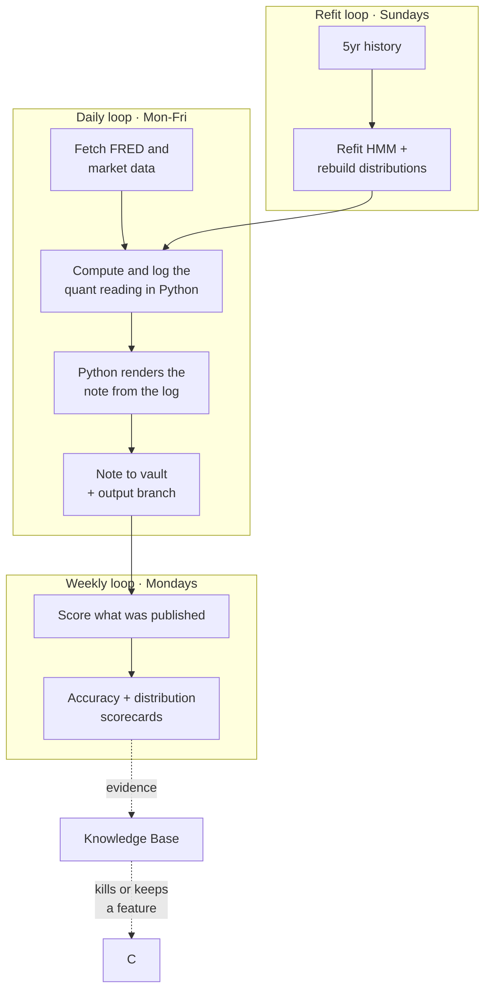

# What this is

## The one-paragraph version

Macro-Assist is a personal macro research system that runs itself. Five mornings
a week it collects economic and market data from free sources, computes a layer
of quantitative context in Python, and delivers a Markdown note to a personal
Obsidian vault. Once a week it grades what it published. Once a week it refits
its statistical models. Since v2.2 the note makes no LLM call, so it costs
nothing in API calls day to day and nothing in infrastructure. Until then a small
team of Claude agents wrote an analysis over the numbers; that prose was
unscored, and the owner switched it off ([ADR-0024](../decisions/ADR-0024-the-note-makes-no-llm-call.md)).

The interesting part is the grading loop. It has been running long enough, and
honestly enough, to have **falsified the system's original product** — and the
project's response was to delete that product rather than defend it.

## What it produces

One Markdown note per weekday, in the vault at
`Economy/YYYY/MM-Month/YYYY-MM-DD-Weekday-macro.md`, with an archived copy on
the repo's `output` branch. Since v2.2 the note carries, in order:

1. **Fragility Monitor** — the headline risk read. A 0–100 composite tail-risk
   gauge plus a higher-recall OR-of-channels flag, computed in Python. It ships
   with its own honest limit attached inline: precision ≈ 0.32, so most firings
   are false alarms. That is the intended trade — it is a high-recall "this is
   not a normal tape" warning, never a forecast.
2. **Volatility Targeting** — per asset with a volatility forecast, the share of
   a normal position to hold: the asset's typical (5-year) volatility divided by
   its forecast, capped at 100%. The textbook risk dial, and labelled as that:
   it makes no directional claim and has not been measured here as adding
   return.
3. **The 5-Day Outlook table** — per asset, the **empirical conditional return
   distribution** for the current macro state (median, P25/P75, sample count),
   rendered by Python from a fitted table.
4. **A data snapshot** — markets, sector ETFs, macro indicators.

From v1.6 to v2.1 a model also wrote an executive summary, per-asset prose,
portfolio and sector reads, and a driver and target range per asset. None of it
was scored. The repo variable `NOTE_ANALYSIS=llm` brings it back.

Weekly, it also produces an accuracy report and — since Phase 22 — a
distribution scorecard.

## What it deliberately does not produce

**A directional call.** Until v1.5 the outlook table led with `Bias`
(Bullish/Bearish/Neutral) and `Confidence %`. Those columns are gone, the schema
no longer has the fields, and the model is not asked for the call. Three
independent measurements said the call carried no information and one said the
task itself was not learnable. The full story is [The cut](the-cut.md).

This is the single most important thing to understand about the repository,
because roughly half the code and most of the documentation predates it.

## The three loops

```mermaid
flowchart TD
    subgraph daily["Daily loop · Mon-Fri"]
        A[Fetch FRED and<br/>market data] --> B[Compute and log the<br/>quant reading in Python]
        B --> D[Python renders the<br/>note from the log]
        D --> E[Note to vault<br/>+ output branch]
    end

    subgraph weekly["Weekly loop · Mondays"]
        E --> F[Score what was published]
        F --> G[Accuracy + distribution<br/>scorecards]
    end

    subgraph refit["Refit loop · Sundays"]
        H[5yr history] --> I[Refit HMM +<br/>rebuild distributions]
        I --> B
    end

    G -.->|"evidence"| K[Knowledge Base]
    K -.->|"kills or keeps<br/>a feature"| C
```

The dotted line is the one that matters. The scoring loop does not feed numbers
back into tomorrow's prompt — that machinery existed until v1.6 and was
retired ([ADR-0009](../decisions/ADR-0009-cut-the-directional-product.md)). It
feeds **findings into the Knowledge Base**, and findings change what the system
is allowed to publish at all. The feedback loop operates on the product, not on
the prediction.

## Who it is for

- **Its author**, as a daily macro briefing and as a research vehicle.
- **Anyone evaluating the method.** The system is small; the discipline around
  measuring it is the transferable part. See [The method](the-method.md).

It is explicitly **not** investment advice, and the one place it touches
position sizing — the paper portfolio in
[Phase 20](../record/roadmap.md) — is a simulated forward test with no broker,
currently stalled because the input it sized from was withdrawn.

## The scale of the thing

| | |
|---|---|
| Python modules | 49 source modules, ~20.7k lines |
| Test suite | 33 test modules, ~9.7k lines, run on every change |
| Data sources | FRED (16 series), yfinance, CFTC, BLS, Supadata — all free |
| LLM calls | None per daily note since v2.2 (four until then) |
| Infrastructure | GitHub Actions + one external cron caller. No servers. |
| Knowledge Base | 26 entries (numbered to KB-027), of which the majority are **negative results** |

That last row is the point of the project.

---

**Next:** [The signal stack](the-signal-stack.md) — how a FRED series becomes a
published claim.
